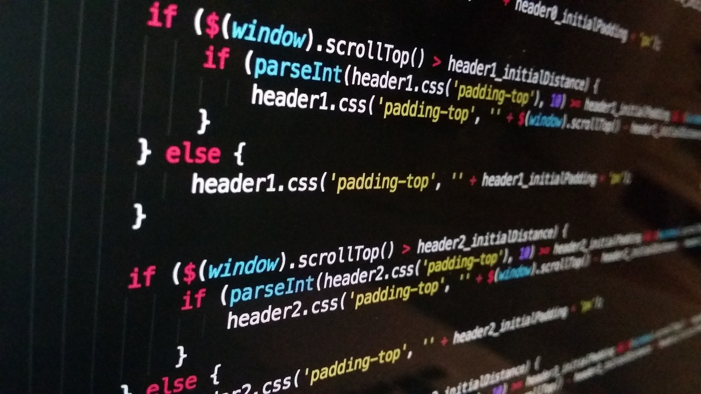

Mi nombre es Cristian Vidal, estudiante de 38 años que cursa la carrera de progración en la Universidad Nacional de Hurlingham (UNAHUR). La UNAHUR es una institución pública y gratuita ubicada en la localidad de Hurlingham, en la provincia de Buenos Aires, Argentina

## Investigación en Pogración: 
Podría mencionar el interés en investigar y comprender los procesos y técnicas relacionadas con esta disciplina.

## Programación y Algoritmos: 
Interés en la programación y la lógica detrás de los algoritmos. Puede mencionarse su pasión por resolver problemas y crear soluciones eficientes.

## Robótica y Automatización:
Podría destacar mi interés en explorar cómo aplicar estos conceptos en la práctica.

## Colaboración Interdisciplinaria:
Colaborar con estudiantes de otras áreas, como ingeniería, matemáticas o electrónica. Esto podría enriquecer su experiencia académica.

## Links importantes :monocle_face:
- [x] [Página principal](https://obj1-unahur.github.io/) de la materia (no olviden entrar seguido!) 
- [x] [Cronograma](https://docs.google.com/spreadsheets/d/1wgWsQU43DDMyEr09BMkIvYmpA4GTBccfb_7I6ec0Hvw/edit?gid=1006593733#gid=1006593733) de clases.

